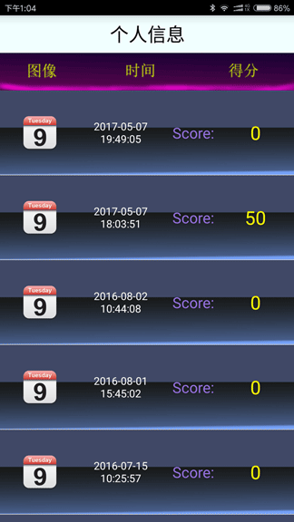

# AndroidTeris
## 2015年9月（大学时期）大三开发Android版俄罗斯方块 
#### 	 主要运用Android 四大组件实现完成俄罗斯方块, Bmob服务器实现后台数据，登录信息和游戏排名。sharePreference实现配置信息的储存。Service实现游戏背景音乐，运用fragment实现说明页面，并自定义UI组件实现俄罗斯方块游戏界面的显示。 游戏开发时间比较早，有不完善的地方，请谅解。
 

  

  

  

  

  
